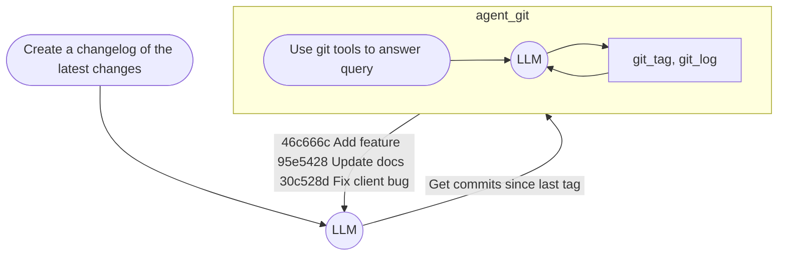

# Prompting is the New Scripting{.whitespace-nowrap}

<Me/>

## {.inline-block .w-15 .m-r-4} Meet GenAIScript{.font-size-8}

{.inline-block .w-30 .absolute .top-0 .right-0 .m-r-12 .m-t-8}

<!-- 
Hey folks, I'm Yohan Lasorsa, and I work as Developer Advocate at Microsoft.

In this session you'll see that GenAI is not all about Python, and that JavaScript also provides unique tools that you can use to drive complex tasks with AI without much effort.
-->

---
layout: cover
class: text-center
background: /images/bg.png
zoom: 2.3
---

<!-- 
## Abstract

**Prompting is the New Scripting: Meet GenAIScript**

jQuery once made web development easier by abstracting away complexities, allowing developers to focus on building rather than battling browser quirks. Today, AI development faces a similar challenge. New patterns emerge constantly and keeping up can be overwhelming, especially as AI tools become more powerful and complex. What if you could leverage cutting-edge AI capabilities to automate tasks using simple, familiar JavaScript abstractions? Enter GenAIScript—a way to integrate AI into your workflow effortlessly, treating prompts like reusable code snippets. In this talk, we’ll explore how GenAIScript makes AI automation feel as intuitive as writing JavaScript, helping you streamline repetitive work without the need for deep AI expertise.
-->

```js
$('#hello').text('DevFest Lyon');
```

<!-- 
If you've done some web development in the past, you may recognize this code.

Nearly 20 years ago, jQuery changed the way we build web applications. It made it easier to manipulate the DOM, handle events, and create animations, when browsers at the time were full of quirks. It was a game-changer, allowing developers like you and me to focus on what we wanted to achieve. 

Today, we face a similar challenge with GenAI. Every week we have new models, new tools, new approaches, and trying to get productive with GenAI while keeping up with all the changes can be exhausting.
-->

---
title: jQuery for GenAI?
layout: cover
background: /images/bg2.png
class: text-center
zoom: 2.3
---

````md magic-move
```js
$`Create an haiku about why JS is awesome`
```

```js
$`Create an haiku about why JS is awesome`

Logic flows like streams,
Dynamic, boundless, it adapts—
JavaScript creates.
```
````

<!-- 
I'm sure this code here somehow looks familiar.

[click] This code is valid JS that makes use of GenAI.
And you'll see in this session that it's way more than just a fancy wrapper for prompts.
-->

---
title: Issue without context
layout: center
---
{.inline-block .border-rounded-xl}

<!-- 
I maintain multiple open source projects on my free time, and I'm always looking for ways to make it more manageable, given that I also have 2 kids at home.

Answering issues like these to explain that you need some context to be able to help, 
-->

---
title: PR without details
layout: center
---
{.inline-block .border-rounded-xl}

<!--
Or looking through all the changes in a PR trying to figure out what was the intent behind the changes - takes time. And it's not the really the fun part of OSS to be honest.

And since I've been working with GenAI for a while now, I thought that it could actually be useful for use cases like this, if I could make it work without too much effort!

That's how I started looking into GenAIScript.
-->

---
zoom: 1.4
layout: center
---

{.inline-block .w-20 .m-r-4 .float-left}
# GenAIScript
[aka.ms/genaiscript](https://aka.ms/genaiscript)

<br>

- Use with CLI, VS Code or GitHub Copilot
- Works with GitHub Models, OpenAI, Anthropic, Ollama...
- Built-in prompts, tools, agents and helpers

<!--
GenAIScript is a Open Source JS toolbox for GenAI, allowing you to create even agents to do complex tasks for you, as simple as writing a script. 

It's really meant to be a developer tool and works best when it's used within a project repository.

But really instead of telling you about its extensive set of features, let's see it in action.

=> DEMO
-->

---
layout: center
zoom: 1.4
---

# Syntax basics

````md magic-move 
```ts {1-2|4-7|9-10|11|12|13|*}
// Prompt templates
$`Say hello to ${name}`;

// Set context
def("README", './README.md');
def("FILE", env.files, { glob: "**/*.js" });
def("WEBSITE", 'https://microsoft.com');

// Special formats
defImage("PICTURE", 'https://http.cat/403');
defData("DATA", csv, { format: "json" });
defDiff("DIFF", "cat", "dog");
defSchema("SCHEMA", MyObjectType);
```
````

<!-- 
Let's do a quick recap of some elements of the syntax.
-->

---
layout: center
zoom: 1.4
---

# Tools and agents

````md magic-move 
```ts {1-6|8-15|14|*}
// Create tools
defTool(
  'random',
  'Generate a random number',
  async () => Math.random(),
);

// Create agents
defAgent(
  'math', // Also creates agent_math tool
  'Agent that does math operations',
  `You're a math expert.
  Answer the question using provided tools.`,
  { system: 'python', tools: ['random'] },
);
```
````

<!-- 
Now when you need agentic capabilities, you can create tools to allow AI models to manipulate the environment through code, [click]and agents that can wrap a prompt and a set of tools to perform specific tasks.

Note that creating an agent also creates a tool prefixed by `agent_`, and this is how you orchestrate agents in GenAIScript. It doesn't provide any agentic workflow capabilities, so orchestration relies on tools.

If you want more advanced workflow control, you can use other agent frameworks like LangGraph to orchestrate GenAIScript agents.

[click]Also, a quick note about tools vs system here: system config allows to load a system-defined script, that can contains prompts, or multiple agents and tools.
-->

---
class: text-center
zoom: 1.4
---

# <br>Agents = Prompt + Tools
<br>


<!--
Let's explain a bit more how agents works, using an example like our changelog generator.
-->

---
layout: center
zoom: 1.4
---

# Metadata and config

````md magic-move 
```ts {1-4,13|1,13,5-8|1,13,9-10|1,13,11|1,12-13|*}
script({
  title: "LinkedIn post",
  description: "Generates a LinkedIn post",
  group: "socials",
  parameters: {
    topic: "GenAI with JavaScript",
    tone: "professional",
  },
  model: "large", // or "ollama:phi-4"
  temperature: 0.7,
  tools: ["git_list_commits"],
  system: ["system.files"],
});
```
````

<!-- 
You can also fine-tune the behavior of your script using metadata and config settings.

Mention that it uses GitHub models by default.

=> After this slide go back to the demo
-->

---
layout: center
zoom: 1.4
---

# Using MCP tools

````md magic-move 
```ts
script({
  mcpServers: {
    playwright: {
      command: "npx",
      args: ["-y", "@playwright/mcp"],
    },
  },
});
```
```ts
script({
  mcpAgentServers: {
    playwright: {
      description: "An agent that uses playwright to run browser commands.",
      command: "npx",
      args: ["-y", "@playwright/mcp"],
      instructions: "Use the playwright tools to navigate in a browser.",
    },
  },
});
```
````

<!-- 
So we've seen that it's easy to use MCP tools within your scripts.
It use the same syntax as the Claude Desktop app, so you can just copy/paste the config from the docs most of the time.

But as you start using many MCP servers, you might get to a point that you expose so many tools to the LLM that it gets confused about which one to use.

[click] To solve this issue, GenAIScript provides a simple mechanism to wrap each MCP server in its own agents with a custom prompt, so it's easy to solve this issue when needed.
-->

---
layout: center
zoom: 1.3
---

# Expose scripts as MCP tools

```bash
# VS Code command
npx -y genaiscript mcp --groups my-mcp-scripts --cwd '${workspaceFolder}'
```

```json
// Claude config
{
  "mcpServers": {
    "my-tools": {
      "type": "stdio",
      "command": "npx",
      "args": ["-y", "genaiscript", "mcp", "--groups", "my-mcp-scripts"],
      "env": {
        // Optional
        "GENAISCRIPT_DEFAULT_MODEL": "<your_model_config>",
      }
    }
  }
}
```

<!-- 
We've also seen that the GenAIScript CLI can run as an MCP server, allowing you to expose your scripts as MCP tools to use with other clients, like VS Code or Claude.

There's also a --remote option to use scripts from any GitHub repository, so it's easy to share your scripts with others.
-->

---
title: There's more
layout: cover
background: 'linear-gradient(#0005, #000a, #0008), url(/images/bg2.png)'
class: align-middle, font-size-4, more-slide
zoom: 1.4
---

<style>
.more-slide span {
  opacity: 0;
  @apply animate-keyframes-fade-in animate-duration-1000 animate-ease-in-out animate-fill-mode-forwards;
  animation-delay: calc(var(--o) * 300ms + .5s);
}
.no-anim {
  opacity: 1 !important;
  animation: none !important;
}
</style>

[MCP tools]{.font-size-5.animate-delay-1000 style="--o: 1"} &nbsp;&nbsp;&nbsp;&nbsp; [Audio Transcription]{.text-gray-3 style="--o: 17"} &nbsp;&nbsp;&nbsp;&nbsp; Image & Video Input{.font-size-5 style="--o: 8"}

[RAG]{style="--o: 21"} &nbsp;&nbsp;&nbsp;&nbsp; [Structured Outputs]{.font-size-5 style="--o: 4"} &nbsp;&nbsp;&nbsp;&nbsp; [@agentic tools]{.text-gray-3 style="--o: 16"} &nbsp;&nbsp;&nbsp;&nbsp; [Browser control]{style="--o: 9"}

[Multi-Agents]{.font-size-6 style="--o: 0.1"} &nbsp;&nbsp;&nbsp;&nbsp; [🤩]{.font-size-16 .m-4 .inline-block .align-middle .no-anim} &nbsp;&nbsp;&nbsp;&nbsp; [Jupyter Notebooks]{style="--o: 11"}

[PromptFoo evals]{style="--o: 12"} &nbsp;&nbsp;&nbsp; [Office, PDF, XML, CSV, HTML...]{.text-gray-3.font-size-3 style="--o: 6"} &nbsp;&nbsp;&nbsp; [Agent Memory]{.font-size-5 style="--o: 2"} &nbsp;&nbsp; [TypeScript]{.font-size-4 style="--o: 18"}

[Teams Integration]{.text-gray-3 style="--o: 15"} &nbsp;&nbsp;&nbsp;&nbsp; [User Input]{.font-size-5 style="--o: 20"} &nbsp;&nbsp;&nbsp;&nbsp; [Vector Search]{.font-size-3 style="--o: 5"} &nbsp;&nbsp;&nbsp;&nbsp; [Semantic Caching]{style="--o: 13"}

[Containers]{.font-size-5 style="--o: 3"} &nbsp;&nbsp;&nbsp;&nbsp; [JSON schema]{style="--o: 14"} &nbsp;&nbsp;&nbsp;&nbsp; [Jinja Templates]{.text-gray-3 style="--o: 7"} &nbsp;&nbsp;&nbsp;&nbsp; [Zod]{style="--o: 19"}

<!--
There's way more to GenAIScript that what I can show you in this session, and what I learn from the past months using it is that if there's a fancy new AI tool or pattern that you've heard about, there are good chances that GenAIScript already has it or will have it soon.

But there's still one thing that you have to keep in mind...
-->

---
title: It's only a developer tool
layout: center
---

<style>
.slidev-vclick-target {
  opacity: 1;
  transition: all 1s ease;
}

.slidev-vclick-hidden {
  opacity: 0;
  font-size: 0;
}
</style>

# It's<span v-click class="font-size-6 color-white align-middle">&nbsp;(only)</span> a developer tool

<!-- 
Right now, it's build as tool for you to use rather than a framework to build applications. 

[click] I have to mention that it still provides a Node.js API that you can use to call your scripts from any context, so you can experiment with that if you want to.

Now what I hope is that we'll get GenAI frameworks in the future that gets inspired by the simplicity of GenAIScript.
-->

---
title: Conclusion
layout: center
class: font-size-6 w-2/3
---

# Get started{.font-size-10}<br>

- [aka.ms/genaiscript](https://aka.ms/genaiscript)
- [aka.ms/genaiscript/talk](https://aka.ms/genaiscript/talk)
- [aka.ms/genaiscript/samples](https://aka.ms/genaiscript/samples)

{.w-50 .absolute .right-8em .top-1/2 .transform .-translate-y-1/2}

<Contact/>

<!--
If you feel like GenAI and agents could help you automate some of your tasks, but you don’t know where to start and you don't want to spend too much time on it, I think GenAIScript is a great place to begin.

Thank you!
-->

---
hide: disabled
layout: cover
background: url(/images/genai-js.png)
---

[aka.ms/genai-js-course](https://aka.ms/genai-js-course){.float-left .font-size-9 .bg-black .rounded-full .p-4 .m-4 .op-80 .ml-24}

{.w-50 .absolute .right-8em .top-1/2 .transform .-translate-y-1/2}

<!-- 
Also, if you want to dig more into the GenAI fundamentals, we have this free course focused on using GenAi with JavaScript, with a lot of demos, so be sure to check it out.
-->

---
title: Conclusion
layout: center
class: font-size-6 w-2/3
---

# Your feedback 🫵 🙏{.font-size-10}<br>

{.w-50 .absolute .right-8em .top-1/2 .transform .-translate-y-1/2}
