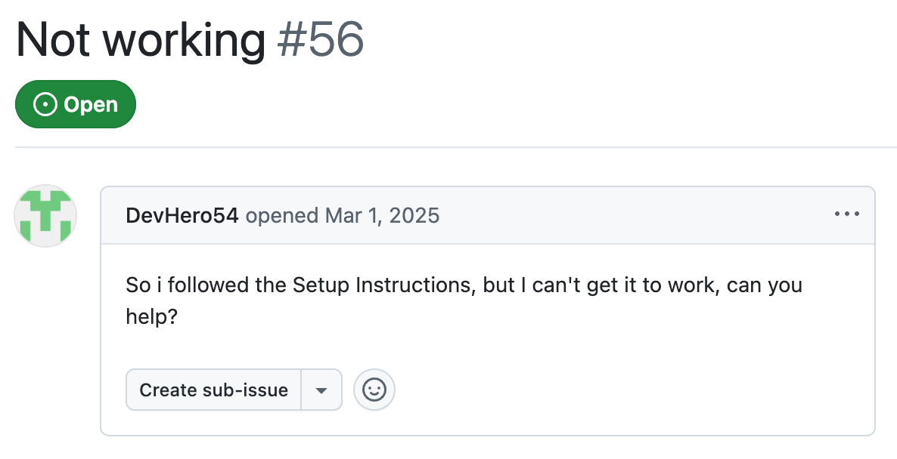
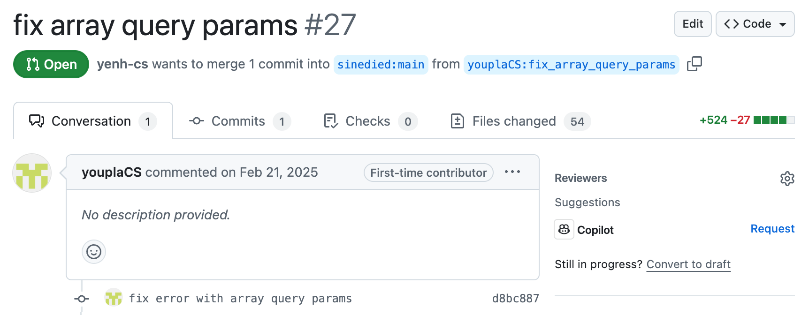

```js
$('#hello').text('DotJS');
```

<!-- 
jQuery once simplified web development by abstracting away complexities—and I think AI needs the same today.

Nearly 20 years ago, jQuery changed the way we build web applications. It made it easier to manipulate the DOM, handle events, and create animations. It was a game-changer, abstracting away the complexities and quirks of cross-browser compatibility, allowing developers like me to focus on what they wanted to achieve. AI needs the same today.
-->

---
title: jQuery for GenAI?
layout: cover
background: ./images/bg2.png
class: text-center
zoom: 2.3
---

````md magic-move
```js
$`Create an haiku about why JS is awesome`
```

```js
$`Create an haiku about why JS is awesome`

Logic flows like streams,
Dynamic, boundless, it adapts—
JavaScript creates.
```
````

<!-- 
I'm sure you can see something familiar here.
This code here is valid JS that makes use of GenAI.
And you're going to see that it's way more than a simple wrapper for prompts.
-->

---
layout: cover
background: 'linear-gradient(#0000, #0008, #0000), url(images/bg5.png)'
# background: 'linear-gradient(#0005, #000a, #0008), url(images/bg2.png)'
class: text-left
zoom: .99
---

# Prompting is the New Scripting

<Me class="animate-keyframes-fade-in animate-duration-1000 animate-ease-in-out animate-fill-mode-forwards animate-delay-2000 op-0"/>

## {.inline-block .w-15 .m-r-4} Meet GenAIScript{.font-size-8}

<!--
Hey folks, I'm Yohan Lasorsa, and I work as Developer Advocate at Microsoft.
I maintain many open source projects on my free time, and I'm always looking for ways to make it more manageable.
-->

---
title: Issue without context
layout: center
---
{.inline-block .border-rounded-xl}

<!-- 
Answering issues like these to explain that you need some context to be able to help, 
-->

---
title: PR without details
layout: center
---
{.inline-block .border-rounded-xl}

<!--
Or looking through all the changes in a PR trying to understand it - takes time. And it's not the really the fun part.

And since I've been working with GenAI for a while now, I thought that it could actually be useful for stuff like this, if I could make it work without too much effort!

That's how I started looking into GenAIScript.
-->

---
zoom: 1.4
layout: center
# layout: image-left
# image: images/genaiscript.svg
---

{.inline-block .w-20 .m-r-4 .float-left}
# GenAIScript
[aka.ms/genaiscript](https://aka.ms/genaiscript)

<br>

- Use with CLI, VS Code or GitHub Copilot
- Works with GitHub Models, OpenAI, Anthropic, Ollama...
- Built-in prompts, tools, agents and helpers
<!-- - Supports MCP, vector search, RAG, multi-modal... -->

<!--
GenAIScript is a Open Source JS toolbox for GenAI that helps you get more productive with it, allowing you to create even agents to do complex tasks for you, as simple as writing a script. 

It's really meant to be a developer tool and works best when it's used within a project repository.

But really instead of telling you about its extensive set of features, let's see it in action.

=> Switch to DEMO
-->

---
layout: left
image: images/genaiscript.svg
hide: true
---

# Syntax recap

```ts
// Prompt templates
$`Say hello to ${name}`

// Set context
def(README, 'README.md')
defImage(PICTURE, 'https://sli.dev/logo-square.png')

// Create tools
defTool(
  'random',
  'Generate a random number',
  async () => Math.random(),
)

// Create agents
defAgent(
  'math',
  'Agent that does math operations',
  `You're a math expert. Answer the question using provided tools.`,
  { system: 'python', tools: ['random'] },
)
```

<!--
Notes can also sync with clicks

[click] This will be highlighted after the first click

[click] Highlighted with `count = ref(0)`

[click:3] Last click (skip two clicks)
-->

---
title: There's more
layout: cover
background: images/bg2.png
class: align-middle, font-size-4, more-slide
zoom: 1.4
---

<style>
.more-slide span {
  opacity: 0;
  @apply animate-keyframes-fade-in animate-duration-1000 animate-ease-in-out animate-fill-mode-forwards;
  animation-delay: calc(var(--o) * 300ms + 2s);
}
.no-anim {
  opacity: 1 !important;
  animation: none !important;
}
</style>

[MCP tools]{.font-size-5.animate-delay-1000 style="--o: 1"} &nbsp;&nbsp;&nbsp;&nbsp; [Audio Transcription]{.text-gray-3 style="--o: 17"} &nbsp;&nbsp;&nbsp;&nbsp; Image & Video Input{.font-size-5 style="--o: 8"}

[RAG]{style="--o: 21"} &nbsp;&nbsp;&nbsp;&nbsp; [Structured Outputs]{.font-size-5 style="--o: 4"} &nbsp;&nbsp;&nbsp;&nbsp; [@agentic tools]{.text-gray-3 style="--o: 16"} &nbsp;&nbsp;&nbsp;&nbsp; [Browser control]{style="--o: 9"}

[Multi-Agents]{.font-size-6 style="--o: 0.1"} &nbsp;&nbsp;&nbsp;&nbsp; [🤩]{.font-size-16 .m-4 .inline-block .align-middle .no-anim} &nbsp;&nbsp;&nbsp;&nbsp; [Jupyter Notebooks]{style="--o: 11"}

[PromptFoo evals]{style="--o: 12"} &nbsp;&nbsp;&nbsp; [Office, PDF, XML, CSV, HTML...]{.text-gray-3.font-size-3 style="--o: 6"} &nbsp;&nbsp;&nbsp; [Agent Memory]{.font-size-5 style="--o: 2"} &nbsp;&nbsp; [TypeScript]{.font-size-4 style="--o: 18"}

[Teams Integration]{.text-gray-3 style="--o: 15"} &nbsp;&nbsp;&nbsp;&nbsp; [User Input]{.font-size-5 style="--o: 20"} &nbsp;&nbsp;&nbsp;&nbsp; [Vector Search]{.font-size-3 style="--o: 5"} &nbsp;&nbsp;&nbsp;&nbsp; [Semantic Caching]{style="--o: 13"}

[Containers]{.font-size-5 style="--o: 3"} &nbsp;&nbsp;&nbsp;&nbsp; [JSON schema]{style="--o: 14"} &nbsp;&nbsp;&nbsp;&nbsp; [Jinja Templates]{.text-gray-3 style="--o: 7"} &nbsp;&nbsp;&nbsp;&nbsp; [Zod]{style="--o: 19"}

<!--
There's way more to GenAIScript that what I can show you in 20min, and if there's a fancy new AI tool or pattern that you've heard about, there are good chances that GenAIScript already has it or will have it soon.

But to my regret there's a small catch...
-->

---
title: It's only a developer tool
layout: center
---

<style>
.slidev-vclick-target {
  opacity: 1;
  transition: all 1s ease;
}

.slidev-vclick-hidden {
  opacity: 0;
  font-size: 0;
}
</style>

# It's<span v-click class="font-size-6 color-white align-middle">&nbsp;(only)</span> a developer tool

<!-- 
Right now, it's build as tool for you to use rather than a framework to build applications. but I hope that we'll get GenAI frameworks in the future that gets inspired by this simplicity.
-->

---
layout: center
class: font-size-6
---

# Links{.font-size-10}<br>

<!-- qrcode -->
- Slides: [bit.ly/genaiscript-talk](https://bit.ly/genaiscript-talk)
- Tool: [aka.ms/genaiscript](https://aka.ms/genaiscript)

<Contact/>

<!--
If you feel like GenAI could help you automate some of your tasks, but you don’t know where to start and you don't want to spend too much time on it, I think GenAIScript is a great place to begin.
-->
